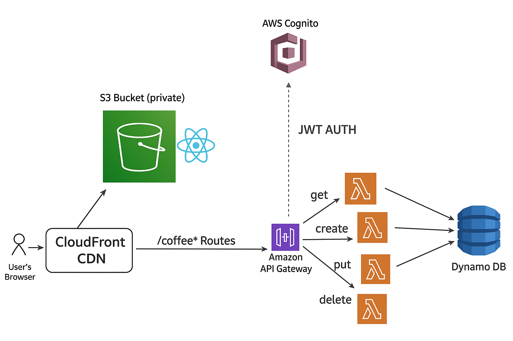

# AWS Serverless Coffee Shop CRUD Application

A full-stack serverless application built with AWS services for coffee shop inventory management. This project demonstrates a complete serverless architecture using React frontend, AWS Lambda, DynamoDB, API Gateway, Cognito authentication, and CloudFront CDN.

## 🚀 Live Demo

**[View Live Application](https://d2m5qnl9omftud.cloudfront.net)**

## 📋 Table of Contents

- [Features](#features)
- [Architecture](#architecture)
- [Technologies Used](#technologies-used)
- [Prerequisites](#prerequisites)
- [Installation & Setup](#installation--setup)
- [API Endpoints](#api-endpoints)
- [Project Structure](#project-structure)
- [Deployment](#deployment)
- [Environment Variables](#environment-variables)
- [Contributing](#contributing)
- [License](#license)

## ✨ Features

- **Complete CRUD Operations**: Create, Read, Update, and Delete coffee items
- **User Authentication**: Secure login/logout with AWS Cognito
- **Responsive UI**: Modern React-based frontend with routing
- **Real-time Updates**: Dynamic coffee inventory management
- **Serverless Architecture**: No server management required
- **Global CDN**: Fast content delivery via CloudFront
- **Cost Effective**: Pay-per-use AWS services

## 🏗️ Architecture

The application follows a serverless architecture pattern:

- **Frontend**: React SPA hosted on CloudFront CDN
- **API Layer**: AWS API Gateway with JWT authorization
- **Compute**: AWS Lambda functions for business logic
- **Database**: DynamoDB for data persistence
- **Authentication**: AWS Cognito User Pools
- **CDN**: CloudFront for global content distribution

## 🛠️ Technologies Used

### Backend
- **AWS Lambda** - Serverless compute functions
- **AWS API Gateway** - HTTP API management
- **Amazon DynamoDB** - NoSQL database
- **AWS Cognito** - User authentication and management
- **AWS CloudFront** - Content delivery network
- **AWS IAM** - Identity and access management

### Frontend
- **React 18** - Frontend framework
- **React Router DOM** - Client-side routing
- **React OIDC Context** - Authentication integration
- **Vite** - Build tool and development server

### Development Tools
- **Node.js** - Runtime environment
- **AWS SDK v3** - AWS service integration
- **Lambda Layers** - Dependency management
- **Postman** - API testing

## 📋 Prerequisites

- AWS Account with appropriate permissions
- Node.js (v18+ recommended)
- npm or yarn package manager
- Basic understanding of AWS services
- Postman (optional, for API testing)

## 🚀 Installation & Setup

### 1. Clone the Repository
git clone <your-repo-url>
cd aws-serverless-coffee-shop

### 2. Backend Setup (AWS Resources)

#### DynamoDB Table
1. Create table named `coffee-shop`
2. Partition key: `coffeeId` (String)
3. Use default settings

#### IAM Role
1. Create role: `coffee-shop-role`
2. Attach policies:
   - `AWSLambdaBasicExecutionRole`
   - Custom inline policy for DynamoDB operations

#### Lambda Functions
Create the following Lambda functions with Node.js 20.x runtime:

- `get-coffee` - Retrieve coffee items
- `create-coffee` - Add new coffee items  
- `update-coffee` - Update existing coffee items
- `delete-coffee` - Remove coffee items

#### Lambda Layer
1. Create layer: `dynamodb-layer`
2. Upload dependencies and utility functions
3. Attach to all Lambda functions

#### API Gateway
1. Create HTTP API: `coffee-shop-api`
2. Configure routes:
   - `GET /coffee` - List all coffees
   - `GET /coffee/{id}` - Get specific coffee
   - `POST /coffee` - Create coffee
   - `PUT /coffee/{id}` - Update coffee
   - `DELETE /coffee/{id}` - Delete coffee

#### Cognito User Pool
1. Create user pool: `coffee-shop-users`
2. Configure app client
3. Set up JWT authorizer in API Gateway

#### CloudFront Distribution
1. Create distribution with API Gateway and S3 origins
2. Configure custom domain (optional)

### 3. Frontend Setup
cd frontend
npm install

Create `.env` file:
VITE_API_URL=https://your-api-gateway-url
VITE_COGNITO_DOMAIN=your-cognito-domain
VITE_COGNITO_CLIENT_ID=your-client-id
VITE_COGNITO_REDIRECT_URI=http://localhost:5173

### 4. Local Development

The application will be available at `http://localhost:5173`

## 🔌 API Endpoints

| Method | Endpoint | Description | Authentication |
|--------|----------|-------------|----------------|
| GET | `/coffee` | Get all coffee items | Required |
| GET | `/coffee/{id}` | Get specific coffee item | Required |
| POST | `/coffee` | Create new coffee item | Required |
| PUT | `/coffee/{id}` | Update coffee item | Required |
| DELETE | `/coffee/{id}` | Delete coffee item | Required |

### Request/Response Examples

#### Create Coffee Item
POST /coffee
Content-Type: application/json
Authorization: Bearer <jwt-token>

{
"coffeeId": "C123",
"name": "Espresso",
"price": 3.50,
"available": true
}

#### Response
{
"statusCode": 201,
"body": {
"message": "Coffee item created successfully",
"item": {
"coffeeId": "C123",
"name": "Espresso",
"price": 3.50,
"available": true
}
}
}

## 🚀 Deployment

### Backend Deployment
1. Zip Lambda function code
2. Upload to AWS Lambda
3. Configure environment variables
4. Attach Lambda layers
5. Set up API Gateway routes
6. Configure Cognito authorization

